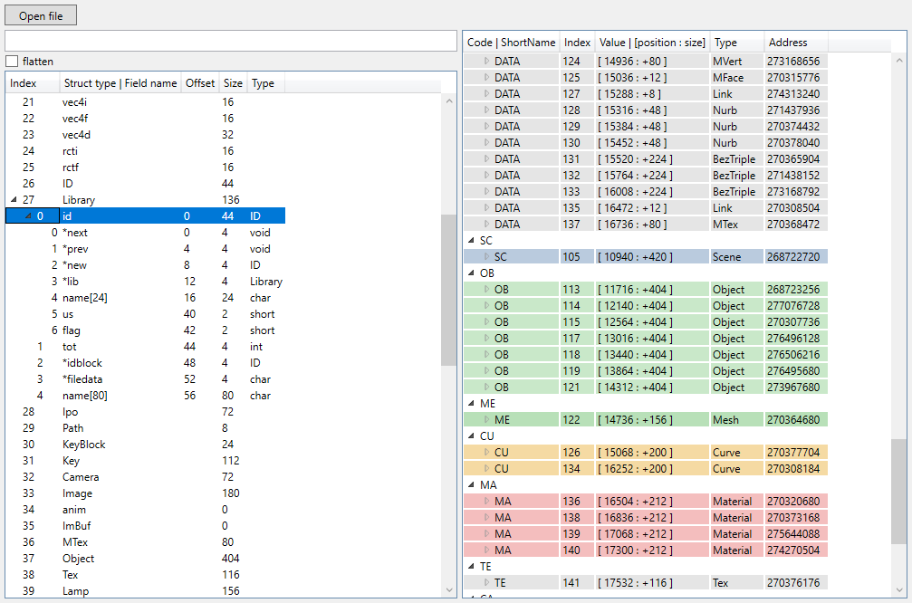

Displays the contents of a Blender file.

Work with Blender file from version 1.0 to 3.0

## Warning

This is a experimental project.
Provided only to understand and "see" the internal structure of a blend file.

if you want to extract or manipulate  data from a Blend file, it is better to use Blender in the background or compile it as a module ([See why not use a blend file directly](https://devtalk.blender.org/t/blender-file-format-import-library/17730)).

Originally written for batch processing and obtain basic information and statistics on several files. 

## References

Official:

- [blender_file_format](https://developer.blender.org/diffusion/B/browse/master/doc/blender_file_format/)
- [blendfile.py](https://developer.blender.org/diffusion/BDT/browse/master/modules/blendfile.py)

Others:

- [Java .Blend File Viewer](https://github.com/homacs/org.cakelab.blender.fileviewer)
- [kaitai.io](https://formats.kaitai.io/blender_blend/index.html)
- [assimp importer](https://github.com/assimp/assimp/blob/master/code/AssetLib/Blender)
